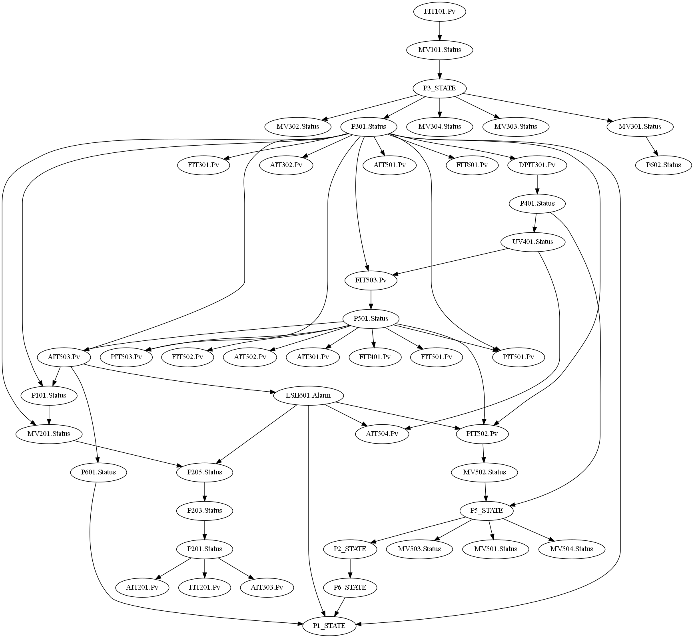

# Causal Graphs
### **Check how you can learn causal graphs from industrial control systems data.**

- **BayesianNetworks.py**: This script reads a set of *ICS (Industrial Control System)* operation data and analyzes this data using the concept of *Bayesian networks*. First, it uses the `HillClimbSearch` and `BicScore` methods to learn the structure of the Bayesian network. Then, it uses the `MaximumLikelihoodEstimator` to estimate the conditional probability distributions. Finally, it saves the edges of the network and the conditional probability distributions of each node to Excel xlsx files.

- **img_plot.py**: This script is used to visualize the Bayesian network generated by *BayesianNetworks.py*. It first reads the edge data saved in the Excel file, then creates a `BayesianModel` object, then converts this object into a *networkx graph*, then visualizes this graph, and saves the image to a file.

  

### How can you use these graphs for risk assessment in industrial control systems? 

- **find_weak_points.py**: This script analyzes the data generated by BayesianNetworks.py and identifies two sets of "weak point" nodes. 
  - The first set is nodes with multiple parents; the behavior of these nodes may be influenced by multiple other nodes and could potentially be the cause of issues.  Saved to **output/nodes_with_high_prob_variance.csv**
  - The second set is nodes with high probability variance given the state of their parent nodes; these nodes may be unstable factors in the system that require special attention. Saved to **output/nodes_with_multiple_parents.csv**
